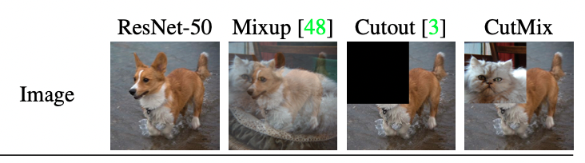
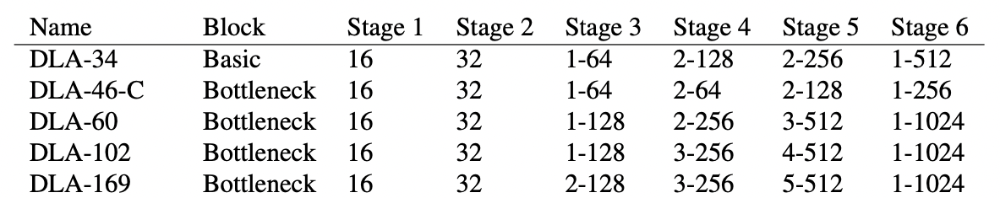

# 人流量统计/人体检测

## 1. 项目说明

本案例面向人流量统计/人体检测等场景，提供基于PaddleDetection的解决方案，希望通过梳理优化模型精度和性能的思路帮助用户更高效的解决实际问题。

应用场景：静态场景下的人员计数和动态场景下的人流量统计


业务难点：

* 遮挡重识别问题。场景中行人可能比较密集，人与人之间存在遮挡问题。这可能会导致误检、漏检问题。同时，对遮挡后重新出现的行人进行准确的重识别也是一个比较复杂的问题。容易出现ID切换问题。

* 行人检测的实时性。在实际应用中，往往对行人检测的处理速度有一定要求。

  

## 2. 数据准备

### 训练数据集

请参照 [数据准备文档](https://github.com/PaddlePaddle/PaddleDetection/blob/release/2.2/docs/tutorials/PrepareMOTDataSet_cn.md) 去下载并准备好所有的数据集，包括 Caltech Pedestrian, CityPersons, CHUK-SYSU, PRW, ETHZ, MOT17和MOT16。训练时，我们采用前六个数据集，共 53694 张已标注好的数据集用于训练。MOT16作为评测数据集。所有的行人都有检测框标签，部分有ID标签。如果您想使用这些数据集，请遵循他们的License。对数据集的详细介绍参见：[数据集介绍](dataset.md)

### 数据格式

上述数据集都遵循以下结构：

```
Caltech
   |——————images
   |        └——————00001.jpg
   |        |—————— ...
   |        └——————0000N.jpg
   └——————labels_with_ids
            └——————00001.txt
            |—————— ...
            └——————0000N.txt
MOT17
   |——————images
   |        └——————train
   |        └——————test
   └——————labels_with_ids
            └——————train
```

所有数据集的标注是以统一数据格式提供的。各个数据集中每张图片都有相应的标注文本。给定一个图像路径，可以通过将字符串`images`替换为 `labels_with_ids`并将 `.jpg`替换为`.txt`来生成标注文本路径。在标注文本中，每行都描述一个边界框，格式如下：

```
[class] [identity] [x_center] [y_center] [width] [height]
```

注意：

* `class`为`0`，目前仅支持单类别多目标跟踪。
* `identity`是从`1`到`num_identifies`的整数(`num_identifies`是数据集中不同物体实例的总数)，如果此框没有`identity`标注，则为`-1`。
* `[x_center] [y_center] [width] [height]`是中心点坐标和宽高，它们的值是基于图片的宽度/高度进行标准化的，因此值为从0到1的浮点数。

### 数据集目录

首先按照以下命令下载`image_lists.zip`并解压放在`dataset/mot`目录下：

```bash
wget https://dataset.bj.bcebos.com/mot/image_lists.zip
```

然后依次下载各个数据集并解压，最终目录为：

```
dataset/mot
  |——————image_lists
            |——————caltech.10k.val  
            |——————caltech.all  
            |——————caltech.train  
            |——————caltech.val  
            |——————citypersons.train  
            |——————citypersons.val  
            |——————cuhksysu.train  
            |——————cuhksysu.val  
            |——————eth.train  
            |——————mot15.train  
            |——————mot16.train  
            |——————mot17.train  
            |——————mot20.train  
            |——————prw.train  
            |——————prw.val
  |——————Caltech
  |——————Cityscapes
  |——————CUHKSYSU
  |——————ETHZ
  |——————MOT15
  |——————MOT16
  |——————MOT17
  |——————PRW
```


### 调优数据集

在进行调优时，我们采用 Caltech Pedestrian, CityPersons, CHUK-SYSU, PRW, ETHZ和MOT17中一半的数据集，使用MOT17另一半数据集作为评测数据集。调优时和训练时使用的数据集不同，主要是因为MOT官网的测试集榜单提交流程比较复杂，这种数据集的使用方式也是学术界慢慢摸索出的做消融实验的方法。调优时使用的训练数据共 51035 张。


## 3. 模型选择

PaddleDetection对于多目标追踪算法主要提供了三种模型，DeepSORT、JDE和FairMOT。

- [DeepSORT](https://arxiv.org/abs/1812.00442) (Deep Cosine Metric Learning SORT) 扩展了原有的 [SORT](https://arxiv.org/abs/1703.07402) (Simple Online and Realtime Tracking) 算法，增加了一个CNN模型用于在检测器限定的人体部分图像中提取特征，在深度外观描述的基础上整合外观信息，将检出的目标分配和更新到已有的对应轨迹上即进行一个ReID重识别任务。DeepSORT所需的检测框可以由任意一个检测器来生成，然后读入保存的检测结果和视频图片即可进行跟踪预测。ReID模型此处选择 [PaddleClas](https://github.com/PaddlePaddle/PaddleClas) 提供的`PCB+Pyramid ResNet101`模型。
- [JDE](https://arxiv.org/abs/1909.12605) (Joint Detection and Embedding) 是在一个单一的共享神经网络中同时学习目标检测任务和embedding任务，并同时输出检测结果和对应的外观embedding匹配的算法。JDE原论文是基于Anchor Base的YOLOv3检测器新增加一个ReID分支学习embedding，训练过程被构建为一个多任务联合学习问题，兼顾精度和速度。
- [FairMOT](https://arxiv.org/abs/2004.01888) 以Anchor Free的CenterNet检测器为基础，克服了Anchor-Based的检测框架中anchor和特征不对齐问题，深浅层特征融合使得检测和ReID任务各自获得所需要的特征，并且使用低维度ReID特征，提出了一种由两个同质分支组成的简单baseline来预测像素级目标得分和ReID特征，实现了两个任务之间的公平性，并获得了更高水平的实时多目标跟踪精度。

综合精度和速度，这里我们选择了FairMOT算法进行人流量统计/人体检测。


## 4. 模型训练

下载PaddleDetection

```bash
git clone https://github.com/PaddlePaddle/PaddleDetection.git
```

运行如下代码开始训练模型：

使用两个GPU开启训练

```bash
cd PaddleDetection/
python -m paddle.distributed.launch --log_dir=./fairmot_dla34_30e_1088x608/ --gpus 0,1 tools/train.py -c configs/mot/fairmot/fairmot_dla34_30e_1088x608.yml
```


## 5. 模型评估

FairMOT使用单张GPU通过如下命令一键式启动评估：

```bash
CUDA_VISIBLE_DEVICES=0 python tools/eval_mot.py -c configs/mot/fairmot/fairmot_dla34_30e_1088x608.yml -o weights=output/fairmot_dla34_30e_1088x608/model_final.pdparams
```

**注意:** 默认评估的是MOT-16 Train Set数据集，如需换评估数据集可参照以下代码修改`configs/datasets/mot.yml`，修改`data_root`：

```bash
EvalMOTDataset:
  !MOTImageFolder
    dataset_dir: dataset/mot
    data_root: MOT16/images/train
    keep_ori_im: False # set True if save visualization images or video
```


## 6. 模型优化(进阶)

### 6.1 精度优化

本小节侧重展示在模型优化过程中，提升模型精度的思路。在这些思路中，有些会对精度有所提升，有些没有。在其他人流量统计/人体检测场景中，可以根据实际情况尝试如下策略，不同的场景下可能会有不同的效果。

#### (1) 基线模型选择

本案例采用FairMOT模型作为基线模型，其骨干网络选择是DLA34。基线模型共有三种：

1）训练基于NVIDIA Tesla V100 32G 2GPU，batch size = 6，使用Adam优化器，模型使用CrowdHuman数据集进行预训练；

2）训练基于NVIDIA Tesla V100 32G 4GPU，batch size = 8，使用Momentum优化器，模型使用CrowdHuman数据集进行预训练；

3）训练基于NVIDIA Tesla V100 32G 4GPU，batch size = 8，使用Momentum优化器，模型使用ImageNet数据集进行预训练。

模型优化时使用的数据集，参见 `调优数据集`。

| 模型                                                   | MOTA | 推理速度 |
| ------------------------------------------------------ | ---- | -------- |
| baseline (dla34 2gpu bs6 adam lr=0.0001)               | 70.9 | 15.600   |
| baseline (dla34 4gpu bs8 momentum)                     | 67.5 | 15.291   |
| baseline (dla34 4gpu bs8 momentum + imagenet_pretrain) | 64.3 | 15.314   |


#### (2) 数据增强

**增加cutmix**

下图中展示了三种数据增强的方式：

* Mixup: 将随机两幅图像以一定的全值叠加构成新的图像；
* Cutout：将图像中随机区域剪裁掉，用0像素值来填充；
* CutMix：将一张图像中的随机区域剪裁掉，并随机选取另一张图片，用其对应区域中的像素来填充剪裁掉的部分。



相比于Mixup和Cutout，CutMix在图像分类和目标检测任务上都用哟欧更好的效果。因为CutMix要求模型从局部识别对象，可以进一步增强模型定位能力。

实现上，可以通过修改 `configs/mot/fairmot/__base__/fairmot_reader_1088x608.yml`，加入如下代码，实现CutMix数据增强：

```yaml
TrainReader:
  inputs_def:
    image_shape: [3, 608, 1088]
  sample_transforms:
    - Decode: {}
    - RGBReverse: {}
    - AugmentHSV: {}
    - LetterBoxResize: {target_size: [608, 1088]}
    - MOTRandomAffine: {reject_outside: False}
    - RandomFlip: {}
    
    - Cutmix: {}
    
    - BboxXYXY2XYWH: {}
    - NormalizeBox: {}
    - NormalizeImage: {mean: [0, 0, 0], std: [1, 1, 1]}
    - RGBReverse: {}
    - Permute: {}
```

实验结果：

| 模型                             | MOTA | 推理速度 |
| -------------------------------- | ---- | -------- |
| dla34 4gpu bs8 momentum + cutmix | 67.7 | 15.528   |

在baseline中加入cutmix，模型MOTA提升0.2%。


#### (3) 可变形卷积

可变形卷积（Deformable Convolution Network, DCN）顾名思义就是卷积的位置是可变形的，并非在传统的 $N \times N$ 网格上做卷积，这样的好处就是更准确地提取到我们想要的特征（传统的卷积仅仅只能提取到矩形框的特征），通过一张图我们可以更直观地了解：


在上面这张图里面，左边传统的卷积显然没有提取到完整绵羊的特征，而右边的可变形卷积则提取到了完整的不规则绵羊的特征。本实验在 CenterNet head 中加入了DCN，具体实现方法为：使用 `code/centernet_head_dcn.py` 中的代码替换 `ppdet/modeling/heads/centernet_head.py` 中的代码。

实验结果：

| 模型                          | MOTA | 推理速度 |
| ----------------------------- | ---- | -------- |
| dla34 4gpu bs8 momentum + dcn | 67.2 | 16.695   |

在baseline中加入dcn，模型MOTA降低0.3%。


#### (4) syncbn+ema

**syncbn**

默认情况下，在使用多个GPU卡训练模型的时候，Batch Normalization都是非同步的 (unsynchronized)。每次迭代时，输入被分为多等分，然后在不同的卡上进行前向后向运算，每个卡上的模型都是单独运算的，相应的Batch Normalization也是在卡内完成。因此BN所归一化的样本数量也只局限于卡内的样本数。开启跨卡同步Batch Normalization后，在前向运算时即可得到全局的均值和方差，后向运算时得到相应的全局梯度，卡与卡之间同步。

**ema**

在深度学习中，经常会使用EMA（指数移动平均）这个方法对模型的参数做平均，以求提高测试指标并增加模型鲁棒。指数移动平均（Exponential Moving Average）也叫权重移动平均（Weighted Moving Average），是一种给予近期数据更高权重的平均方法。在深度学习优化中，其基本假设为，模型权重在最后的n步内会在最优点附近震荡，所以我们取n步后的平均值，则能使模型更加鲁棒。

本实验中，使用synbn和ema，可以通过在 `configs/mot/fairmot/_base_/fairmot_dla34.yml` 中，进行如下修改：

```yaml
architecture: FairMOT
pretrain_weights: https://paddledet.bj.bcebos.com/models/pretrained/fairmot_dla34_crowdhuman_pretrained.pdparams
norm_type: sync_bn
use_ema: true
ema_decay: 0.9998
```

实验结果：

| 模型                                   | MOTA | 推理速度 |
| -------------------------------------- | ---- | -------- |
| dla34 4gpu bs8 momentum + syncbn + ema | 67.4 | 16.695   |

在baseline上开启syncbn和ema，模型MOTA降低0.1%。


#### (5) 优化策略

Adam使用动量和自适应学习率来加快收敛速度。对梯度的一阶矩阵估计和二阶矩阵估计进行综合考虑，以此计算更新步长。本实验中可以通过在 `PaddleDetection/configs/mot/fairmot/_base_/optimizer_30e.yml` 中，进行如下修改：

```yaml
LearningRate:
  base_lr: 0.0002
  schedulers:
  - !PiecewiseDecay
    gamma: 0.1
    milestones: [20,]
    use_warmup: False

OptimizerBuilder:
  optimizer:
    type: Adam
  regularizer: NULL
```

实验结果：

| 模型                          | MOTA | 推理速度 |
| ----------------------------- | ---- | -------- |
| dla34 4gpu bs6 adam lr=0.0002 | 71.1 | 15.823   |


#### (6) attention

**Spatial Gate**

用 `code/centernet_fpn_attention.py` 中的代码替换 `PaddleDetection/ppdet/modeling/necks/centernet_fpn.py`。设置 `self.attention = SpatialGate()`。

```python
self.attention = SpatialGate()
# self.attention = SANN_Attention(c_state = False, s_state = True) # spatial_attention
```


**SANN attention**

用 `code/centernet_fpn_attention.py` 中的代码替换 `PaddleDetection/ppdet/modeling/necks/centernet_fpn.py`。设置 `self.attention = SANN_Attention(c_state = False, s_state = True) # spatial_attention` 。

```python
# self.attention = SpatialGate()
self.attention = SANN_Attention(c_state = False, s_state = True) # spatial_attention
```


实验结果：

| 模型                                                         | MOTA | 推理速度 |
| ------------------------------------------------------------ | ---- | -------- |
| dla34 4gpu bs8 momentum + attention                          | 67.6 | -        |
| dla34 4gpu bs6 adam lr=0.0002 + syncbn + ema + attention     | 71.6 | -        |
| dla34 dla34 4gpu bs6 adam lr=0.0002 + syncbn + ema + sann    | 71.1 | -        |
| dla34 4gpu bs6 adam lr=0.0002 + syncbn + ema + attention + cutmix | 71.3 | -        |

在baseline上新增了attention，模型MOTA增加0.1%。在baseline上回合使用优化策略、+syncbn+ema和增加spatial gate/ sann attention，模型MOTA增加4.1% / 3.6%。新增attention部分暂不支持开启TensorRT进行推理。


#### (7) backbone



在本实验中，我们尝试将baseline中的centernet的backbone由DLA-34更换为其他更大的模型，如DLA-46-C、DLA-60及DLA-102。因为更换的backbone都只有在ImageNet上的预训练模型，而我们实验中使用的dla34 backbone 是在CrowdHuman上做过预训练的。所以这一部分的实验结果要与 `baseline (dla34 4gpu bs8 momentum + image_pretrain)` 进行比较。实验结果如下：

| 模型                                         | MOTA | 推理速度 |
| -------------------------------------------- | ---- | -------- |
| dla46c 4gpu bs8 momentum + imagenet_pretrain | 61.2 | 16.863   |
| dla60 4gpu bs8 momentum + imagenet_pretrain  | 58.8 | 12.531   |
| dla60 4gpu bs8 momentum + imagenet_pretrain  | 54.8 | 12.469   |


#### (8) GIoU Loss

GIoU解决了IoU Loss存在的两个问题：

* 预测框如果和真实框没有重叠，则IoU始终为0，损失函数失去可导性；
* IoU无法分辨不同方式的对齐，IoU值相同，但预测框的方向可能完全不同。

GIoU提出一种计算方式，对于两个框A和B，先计算出A、B的最小包围框C，然后根据如下公式计算出GIoU:
$$
GIoU = IoU - \frac{C-(A \cup B)}{C}
$$
GIoU Loss = 1 - GIoU. 如想尝试增加GIoU Loss，可用 `code/centernet_head_iou_head.py` 替换 `ppdet/modeling/heads/centernet_head.py` 中的代码，并且修改 `ppdet/modeling/architectures/fairmot.py` 文件，在第84行增加 `'iou_loss': det_outs['iou_loss'],` : 

```python
det_loss = det_outs['det_loss']
loss = self.loss(det_loss, reid_loss)
loss.update({
  'heatmap_loss': det_outs['heatmap_loss'],
  'size_loss': det_outs['size_loss'],
  'iou_loss': det_outs['iou_loss'],
  'offset_loss': det_outs['offset_loss'],
  'reid_loss': reid_loss
  })
return loss
```

实验结果如下：

| 模型                                                    | MOTA | 推理速度 |
| ------------------------------------------------------- | ---- | -------- |
| dla34 4gpu bs6 adam lr=0.0002 + syncbn + ema + iou head | 71.6 | 15.723   |


### 6.2 性能优化

暂无

全部实验结果：

| 模型                                                         | MOTA | 推理速度（开启TensorRT） |
| ------------------------------------------------------------ | ---- | ------------------------ |
| baseline (dla34 2gpu bs6 adam lr=0.0001)                     | 70.9 | 15.600                   |
| baseline (dla34 4gpu bs8 momentum)                           | 67.5 | 15.291                   |
| baseline (dla34 4gpu bs8 momentum + imagenet_pretrain)       | 64.3 | 15.314                   |
| dla34 4gpu bs8 momentum + dcn                                | 67.2 | 16.695                   |
| dla34 4gpu bs8 momentum + syncbn + ema                       | 67.4 | 15.528                   |
| dla34 4gpu bs8 momentum + cutmix                             | 67.7 | 15.528                   |
| dla34 4gpu bs8 momentum + attention                          | 67.6 | -                        |
| dla34 4gpu bs6 adam lr=0.0002                                | 71.1 | 15.823                   |
| dla34 4gpu bs6 adam lr=0.0002 + syncbn + ema                 | 71.7 | 15.038                   |
| dla34 4gpu bs6 adam lr=0.0002 + syncbn + ema + attention     | 71.6 | -                        |
| dla34 4gpu bs6 adam lr=0.0002 + syncbn + ema + iou head      | 71.6 | 15.723                   |
| dla34 4gpu bs6 adam lr=0.0002 + syncbn + ema + sann          | 71.1 | -                        |
| dla34 4gpu bs6 adam lr=0.0002 + syncbn + ema + attention + cutmix | 71.3 | -                        |
| dla46c 4gpu bs8 momentum + imagenet_pretrain                 | 61.2 | 16.863                   |
| dla60 4gpu bs8 momentum + imagenet_pretrain                  | 58.8 | 12.531                   |
| dla102 4gpu bs8 momentum + imagenet_pretrain                 | 54.8 | 12.469                   |


## 7. 模型预测

使用单个GPU通过如下命令预测一个视频，并保存为视频

```bash
# 预测一个视频
CUDA_VISIBLE_DEVICES=0 python tools/infer_mot.py -c configs/mot/fairmot/fairmot_dla34_30e_1088x608.yml -o weights=https://paddledet.bj.bcebos.com/models/mot/fairmot_dla34_30e_1088x608.pdparams --video_file={your video name}.mp4 --frame_rate=20 --save_videos
```

使用单个GPU通过如下命令预测一个图片文件夹，并保存为视频

```bash
# 预测一个图片文件夹
CUDA_VISIBLE_DEVICES=0 python tools/infer_mot.py -c configs/mot/fairmot/fairmot_dla34_30e_1088x608.yml -o weights=https://paddledet.bj.bcebos.com/models/mot/fairmot_dla34_30e_1088x608.pdparams --image_dir={your infer images folder} --save_videos
```

**注意:** 请先确保已经安装了[ffmpeg](https://ffmpeg.org/ffmpeg.html), Linux(Ubuntu)平台可以直接用以下命令安装：`apt-get update && apt-get install -y ffmpeg`。`--frame_rate`表示视频的帧率，表示每秒抽取多少帧，可以自行设置，默认为-1表示会使用OpenCV读取的视频帧率。


## 8. 模型导出

```bash
CUDA_VISIBLE_DEVICES=0 python tools/export_model.py -c configs/mot/fairmot/fairmot_dla34_30e_1088x608.yml -o weights=https://paddledet.bj.bcebos.com/models/mot/fairmot_dla34_30e_1088x608.pdparams
```


## 9. 模型上线选择


## 引用


